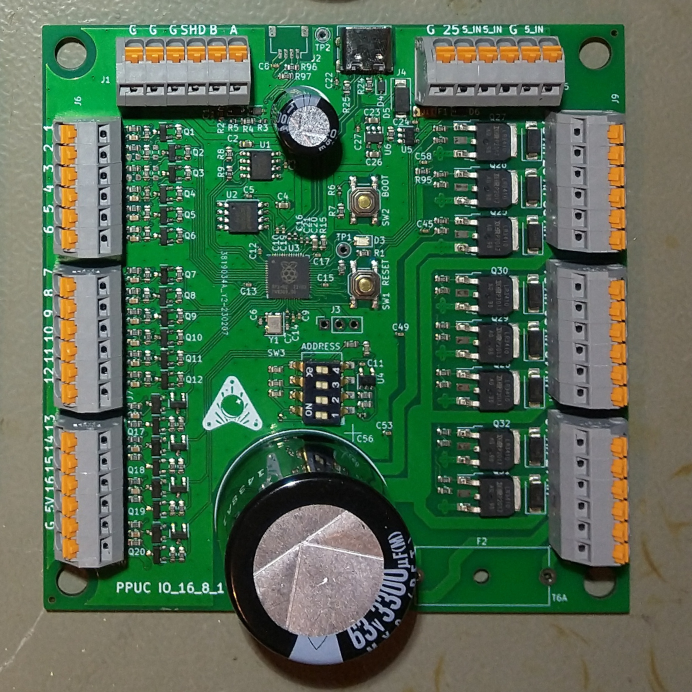

# Standard IO PCB for PPUC Project
This is the hardware for a standard IO card which was designed for the PPUC pinball project, but can be useful in other applications as well.
It is designed for being low cost and functional for experimental use.  
Not everything is tested nor does it fulfill EMC or any other specifications.  
Use at your own risk!
To make use of anything of this project a basic understanding of electronics and programming is necessary. Nothing of it is "plug and play". I'm surely not liable for any damage to assemblies, pinball machines or even persons.

## Picture of the Board

## Name
IO_16_8_1 as it has 16 inputs, 8 outputs and one special output.  
Actually the inputs can also be used as outputs (see later in this document).

## Power Supply
The IO card must be supplied by 5 V (+-0.5 V) for logic and inputs. Additionally nominal 48 V for high power outputs. As these outputs are open drain, the voltage can actually be up to 60 V. In the circuit diagram the voltage is called 48 V.

## Controller
A RP2040 is used for it's cost/performance ratio. It is the same controller that is used in the Raspberry Pi Pico.

## Communication Interfaces
* RS_485: main communication interface for controlling outputs and scan inputs. Usually connected to a host interface like a PC or Raspberry Pi or similar.
* USB C: for programming, debug and flashing
* Serial Wire: alternative for programming, debug and flashing
* IIC: the PCB can be populated with an QWIIC connector (normally not mounted). This can be used for connecting to other PCBs or experimental use. It uses the same UART as for the RS485.
* UART, I2C, SPI: instead of using the input pins for inputs they can also be used as an additional interface (see docu of RP2040 for pins and function). Speed up to 10 kHz should be possible (100 kHz for In_2 and In_3).

## Switches (on board)
* Reset: hardware reset for controller (RP2040)
* Boot: if active the board connects to a PC like an USB stick. Usually used for programming the code into the flash memory on the board.
* DIP-switches: usually used to select an address for RS485 (16 combinations)

## Inputs (and low power outputs)
The 16 inputs are used for reading the state of an external switch. The switch is normally connected to ground (GND). Internally the input is pulled up to 5 V by a 10k resistor.

All inputs can also be used as signal-outputs (if programmed accordingly). The output is internally pulled up by a 10k resistor to 5 V. A higher voltage can be applied externally (max. 30 V) but be sure to have your hardware and software! setup correctly as no protection for damage is provided in that case. A maximum of 2 mA can be sinked/sourced.

The inputs In_2 and In_3 are designed for higher speed (100 kHz). The Pull-Up can be soldered to other pads to be pulled to 3,3 V (instead of 5 V). An input capacitance can be added (soldered) for better noise immunity but lower speed. Since version 1.0.1 the caps are soldered by default and must be removed if a high-speed serial connection is needed.

The input terminals can also be "miss"used for a switch matrix. To do that (no matter if used as coloum or row) the input resistor (330 Ohm) must be short cut (or replaced by a zero Ohm type). Background: the 330 Ohm resistor protects the circuit if the terminal is used as an output and accidently a short cut is done at the terminal. Unfortunately the low voltage value gets too high when used in a switch matrix (diode voltage plus voltage drop due to added up currents through the resistor). This happens when more switches are closed at the same time. Instead you could also use the specially designed PCB "Hardware_IO_16x8_matrix" for your switch matrix.

The inputs In_13 to In_16 have an additional open drain output transistor that allows higher currents in case of being used as an output (up to 3 A at 25 °C ambient temperature). The outputs are internally pulled up by a 10k resistor to 5 V. A higher voltage (max. 30 V) can be applied externally but be sure to have your hardware and software! setup correctly as no protection for damage is provided in that case. Please be aware that the default state (before software takes over control) is "on". 
If used as input In_13 to In_16 feature a memory (similar to a relay self-holding function). If the input has ever seen a low signal (e.g. switch closed to GND) it will stay that way until it gets an active high signal from the RP2040 (make the corresponding pin an output with signal "high" and then make it an input again). If this behavior is not wanted you can lift pin 3 of Q13 to Q16, then you have an input/output like e.g. terminal 1 with static behavior but no additional output power.

## High Power Outputs
There are 8 high power outputs available. Usually they are connected to pinball solenoids or flashers. A recovery diode for the solenoids is placed on the pcb, so no need for diodes at the coils. The outputs are open drain and drive currents up to 6 A with a load connected to a voltage of up to 60 V.

It's recommended to use 2 wires (back and forth) for each solenoid. That improves the EMC a lot.

## Special Output
One special output is available for high speed signals. The voltage is 5 V, it is a push pull output that can drive a current up to 8 mA. It can be used to e.g. control a WS2812 LED strip.

## Recommendations
* Connect only one Flipper to a pcb if possible. The advantage is, that all the energy of the big capacitor is available for the flipper, which is usually the solenoid with the highest current. If you have more flipper fingers than PCBs then spread the flipper solenoids as even as possible across the PCBs (e.g. if you have 6 flipper fingers it's better to connect 2 per board instead of all 6 at one board).
* Wire related switches and solenoids for fast flip devices (e.g. flipper, bumper, sling, kick back) to the same pcb. Then you can archive the shortest possible time lag between activating the switch and firing the solenoid.
* RS485 termination: short JP2 at the end of the RS485 bus. There should also be a 120 Ohm resistor at the beginning of the bus (e.g. USB to RS485 adapter).
* RS485 biasing: short JP1 and JP3 exactly once at any point of the RS485 bus. Only do this if no resistors are installed on the USB to RS485 adapter. 

